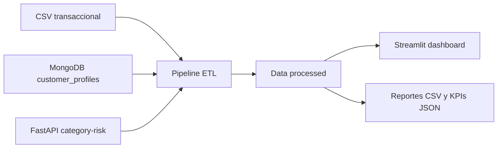

# Arquitectura tecnica

## Componentes

- `etl/bootstrap_sources.py`: carga MongoDB y crea el JSON de referencia para la API.
- `api/metadata_api.py`: expone `/category-risk` y `/health`.
- `etl/run_pipeline.py`: valida columnas, limpia datos, anonimiza tarjetas, crea variables y genera salidas.
- `dashboards/app.py`: presenta vistas ejecutiva, tecnica y operativa.

## Decisiones tecnicas

- Pandas por su eficiencia suficiente para procesamiento por chunks.
- MongoDB como fuente NoSQL para perfiles anonimizados.
- FastAPI para una API REST clara, documentable y testeable.
- Streamlit y Plotly para dashboards interactivos con baja friccion de despliegue.
